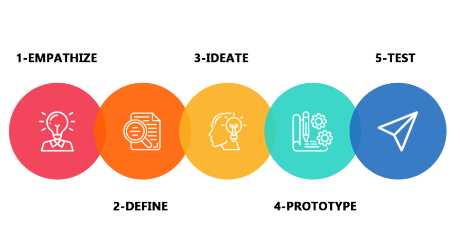
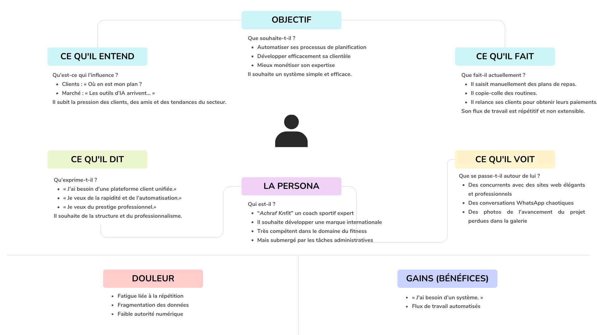
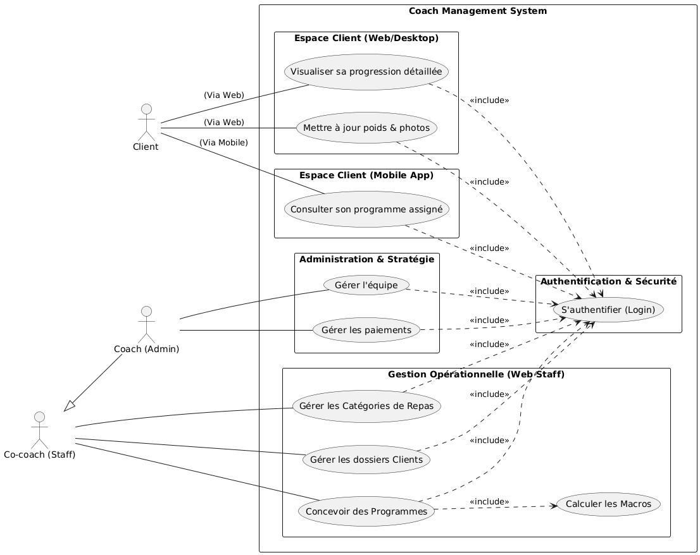
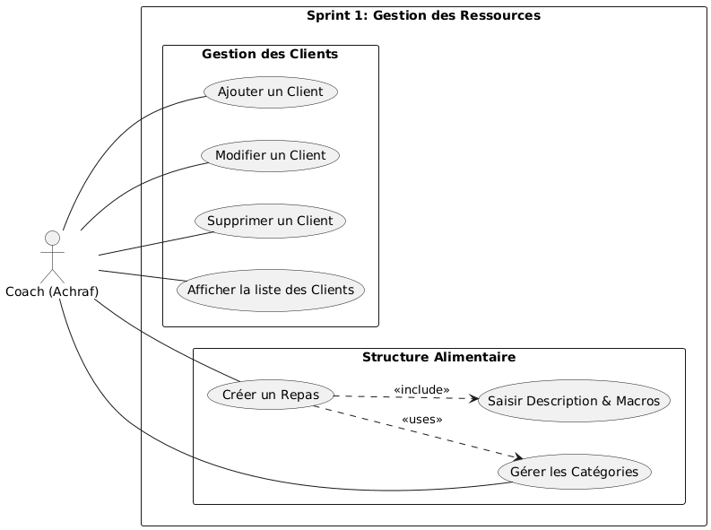
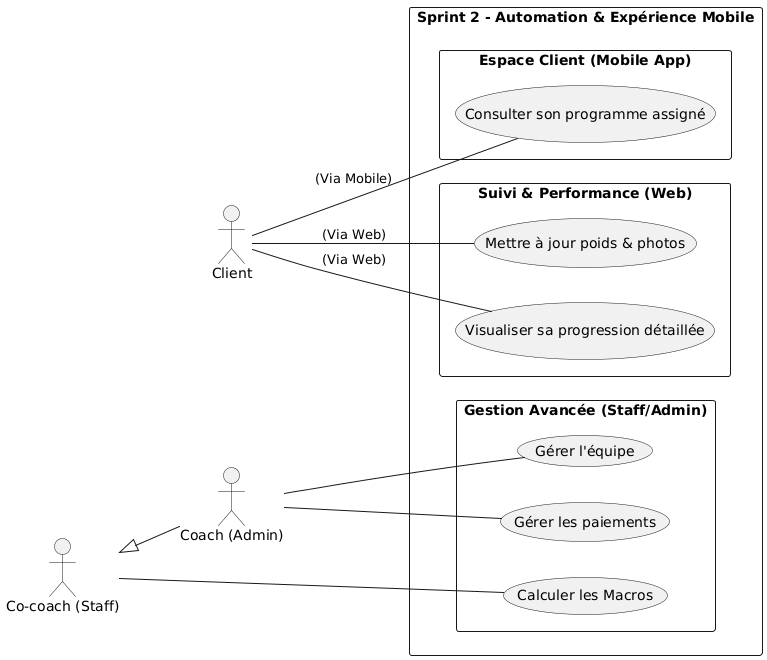
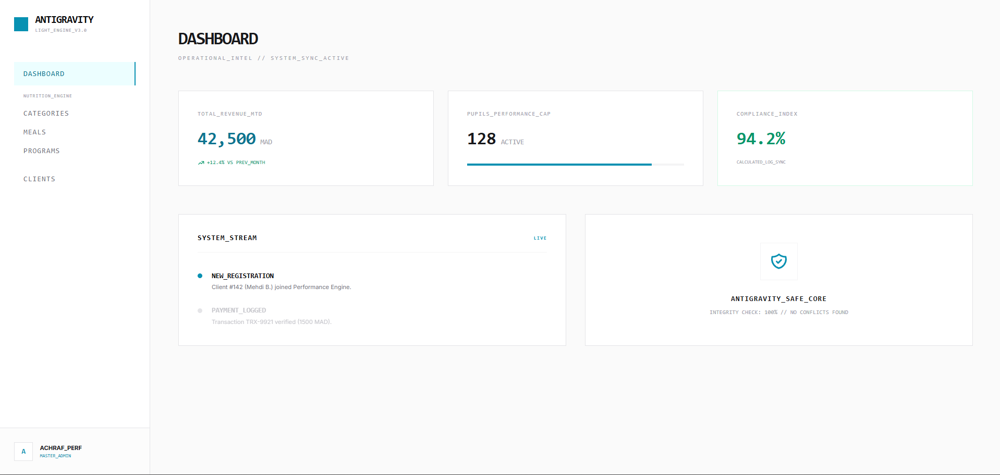
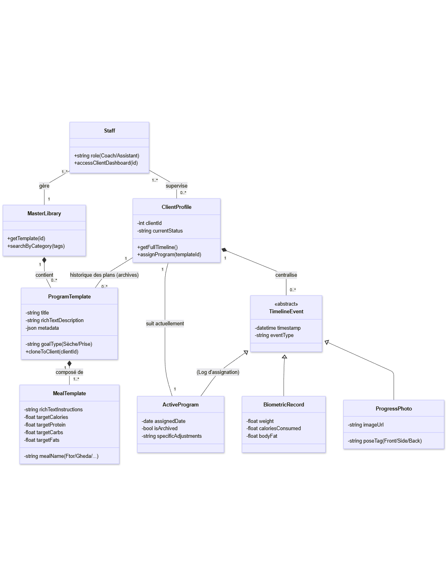

  
  

# Projet de Fin de Formation
### Digitalisation des Services de Coaching : Développement d’une Solution Web Intégrée de Gestion et de Branding

**Réalisé par :** Mehdi Bentaleb  
**Encadré par :** M. ESSARRAJ Fouad  
**Filière :** Développement Mobile et Web

---

## Sommaire

  

1

Contexte du projet

  

2

Méthodologie de travail

  

3

Branche Fonctionnelle

  

4

Branche Technique

  

5

Conception

  

6

Démonstration

  

7

Conclusion

---
## 1. Contexte du projet

  <h4>Contexte : </h4>
  <blockquote style="font-style: italic; background: white; padding: 15px; border-radius: 8px;">
    "Coach Achraf is an experienced fitness coach who helps clients achieve their physical goals through personalized training and nutrition plans.
    However, despite his strong expertise, he faces difficulties in managing administrative tasks such as organizing workout programs, tracking client progress, and handling payments. Most of his work is done manually, which consumes time and reduces efficiency."
  </blockquote>

> This project focuses on analyzing Coach Amin’s needs in order to propose solutions that improve his organization, optimize his workflow, and enhance his professional performance.

---

## 2. Méthodologie : Design Thinking

  

---

## Méthodologie : Scrum (Agile)

  

---

## 3. Branche Fonctionnelle : Design Thinking
### Empathie

  

    <h4> Ce que le Coach ressent :</h4>
    <ul>
      <li><strong>Frustration :</strong> Perte de temps sur WhatsApp/Excel.</li>
      <li><strong>Confusion :</strong> Difficulté à retrouver "ce PDF".</li>
      <li><strong>Surcharge :</strong> Gestion manuelle des paiements.</li>
    </ul>
  

  

    <h4> L'opportunité digitale :</h4>
    <blockquote style="font-style: italic; background: white; padding: 15px; border-radius: 8px; font-size: 0.9em;">
      "Passer d'une gestion artisanale à un <b>Moteur de Nutrition Unifié</b> pour libérer 95% du temps du coach."
    </blockquote>
  

---

## Branche Fonctionnelle : Carte Empathie

  

---

## Branche Fonctionnelle : 2. DÉFINITION

  <h4>Cadrage du problème</h4>
  <blockquote style="font-style: italic; background: white; padding: 15px; border-radius: 8px;">
    "Ses tâches sont réalisées manuellement via des outils dispersés comme WhatsApp et Excel, ce qui entraîne une perte de temps, un manque d’efficacité et une image professionnelle qui ne reflète pas son véritable niveau d’expertise."
  </blockquote>

---

## Branche Fonctionnelle : 3. IDÉATION

  <h4>Plateforme digitale centralisée :</h4>
  
• Gestion des clients & programmes nutrition

  
• Suivi de progression & automatisation des paiements

  <h4>Objectif de l’Idéation</h4>
  > Transformer une gestion manuelle en un système structuré et professionnel.

---

## Branche Fonctionnelle : Cas d'utilisation

### Global Use Case

  

---

## Branche Fonctionnelle : Cas d'utilisation

### Sprint 1 : Gestion de Base

  

---

## Branche Fonctionnelle : Cas d'utilisation

### Sprint 2 : Nutrition & Training

  

---

## Branche Fonctionnelle : Maquettes (UI/UX)

  

---

## 4. Branche Technique : Tech Stack

  

    <h4>Back-end & Architecture</h4>
    <ul>
      <li><strong>DB :</strong> MySQL / <strong>Framework :</strong> Laravel 12</li>
      <li><strong>Architecture :</strong> N-Tiers (Service Layer)</li>
      <li><strong>Spatie :</strong> Rôles & Permissions</li>
    </ul>
  

  

    <h4>Front-end & Outils</h4>
    <ul>
      <li><strong>Styling :</strong> Tailwind CSS</li>
      <li><strong>Dynamic :</strong> Alpine.js & AJAX</li>
      <li><strong>Icons :</strong> Lucide / <strong>Build :</strong> Vite</li>
    </ul>
  

---

## 5. Conception : MLD

<h3>Modélisation des données</h3>

  

---

## 6. Démonstration : Outils

  

    <h4>Développement</h4>
    <ul>
      <li><strong>IDE :</strong> VS Code</li>
      <li><strong>DB :</strong> MySQL Workbench</li>
    </ul>
  

  

    <h4>Gestion & Versioning</h4>
    <ul>
      <li><strong>Git :</strong> GitHub</li>
      <li><strong>UML :</strong> Mermaid / PlantUML</li>
    </ul>
  

---

## 7. Conclusion

### Merci pour votre attention !
**Questions ?**