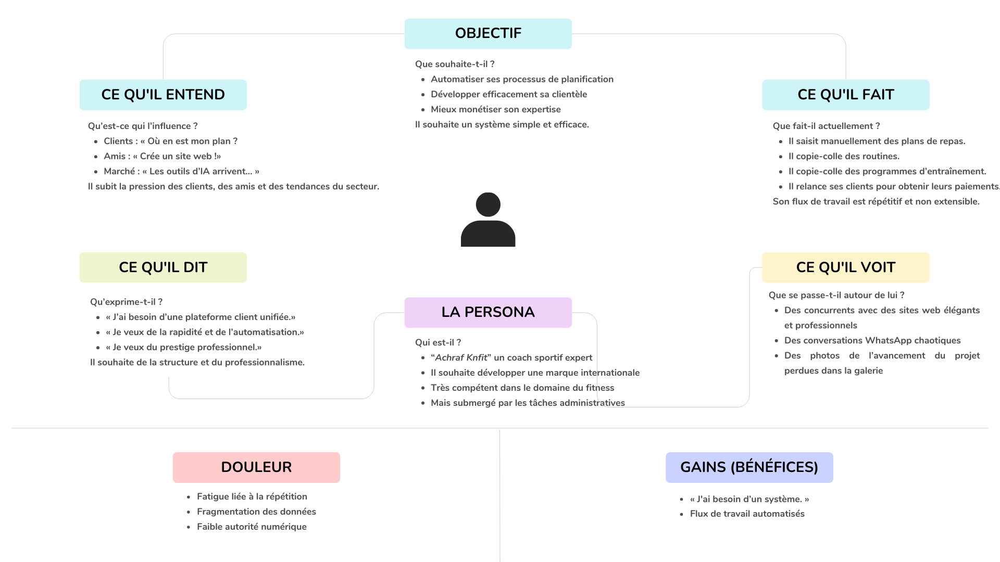
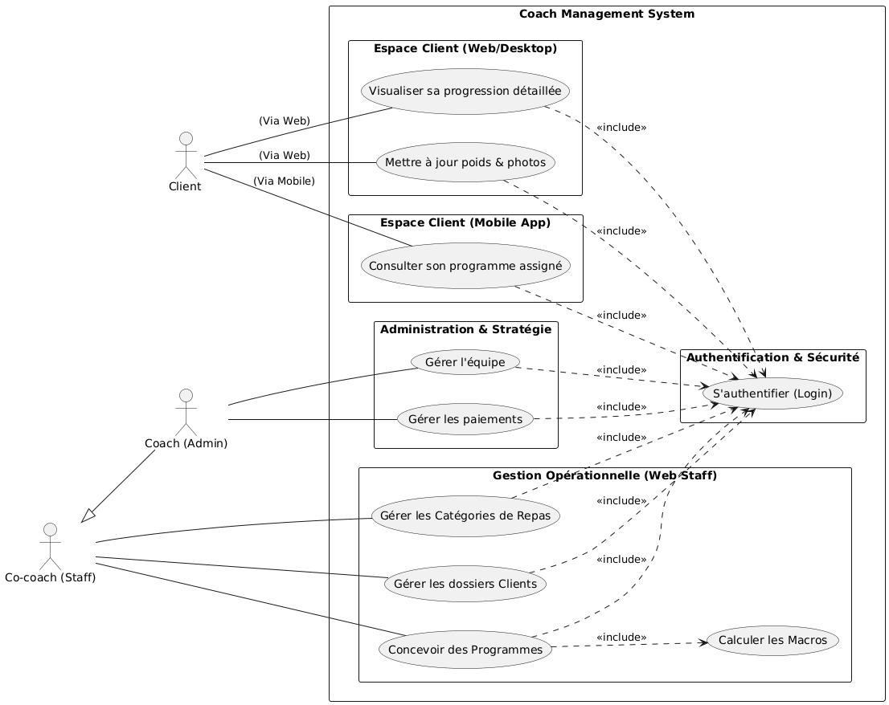
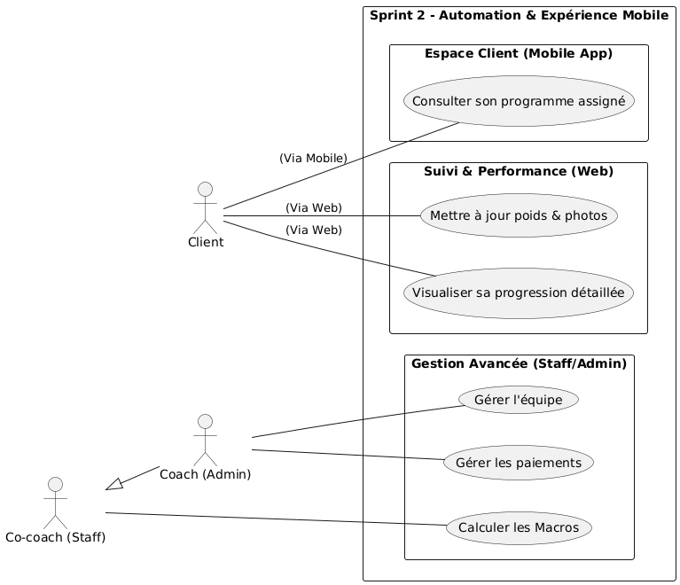

# Rapport de Projet de Fin d'Année
**Sujet :** Conception et Réalisation d'une Solution de Gestion pour Coach Sportif  
**Filière :** Formation de développement Mobile – Mode Bootcamp.

**Présenté par :** Mehdi BenTaleb  
**Encadrant :** Mr. Essarraj Fouad  
**Année de Formation 2025/2026**

---

## Table des Matières

1. [Introduction Générale](#1-introduction-générale)
2. [Contexte du Projet](#2-contexte-du-projet)
    * 2.1 [Défis Opérationnels](#21-défis-opérationnels)
    * 2.2 [Objectifs de la Solution](#22-objectifs-de-la-solution)
3. [Définition du Problème](#3-définition-du-problème)
4. [Analyse d’Empathie (Système Achraf Knfit)](#4-analyse-dempathie-système-achraf-knfit)
    * 4.1 [Profil : Le Coach Principal (Achraf)](#41-profil--le-coach-principal-achraf)
    * 4.2 [Profil : Client](#42-profil--lélève--client)
    * 4.3 [Profil : Le Co-Coach / Manager](#43-profil--le-co-coach--manager)
    * 4.4 [Synthèse de la Vision (Scalabilité)](#44-synthèse-de-la-vision-scalabilité)
5. [Idéation — Conception du Système](#5-idéation--conception-du-système)
    * 5.1 [Le Moteur de Nutrition Unifié](#51-le-moteur-de-nutrition-unifié)
    * 5.2 [Flux de Travail « Anti-Tachot »](#52-flux-de-travail-anti-tachot)
6. [Architecture des Cas d’Utilisation (UML)](#6-architecture-des-cas-dutilisation-uml)
    * 6.1 [Les Acteurs du Système](#61-les-acteurs-du-système)
    * 6.2 [Détail des Cas d’Utilisation](#62-détail-des-cas-dutilisation)
7. [Planification Agile : Sprints et Cas d’Utilisation](#7-planification-agile--sprints-et-cas-dutilisation)
    * 7.1 [Sprint 1 : Fondations et Ressources](#71-sprint-1--fondations-et-ressources)
    * 7.2 [Sprint 2 : Intelligence, Automatisation et Suivi](#72-sprint-2--intelligence-automatisation-et-suivi)
    * 7.3 [Résultat Final du Sprint 2](#73-résultat-final-du-sprint-2)

---

---
## 1. Introduction Générale

Dans un contexte marqué par la **transformation digitale** et l’évolution du secteur du fitness, les coachs sportifs sont aujourd’hui amenés à offrir des services de qualité tout en assurant une gestion efficace de leurs activités.

**Coach Achraf**, coach sportif expérimenté, accompagne ses clients à travers des programmes d’entraînement et des plans nutritionnels personnalisés afin de les aider à atteindre leurs objectifs physiques. Cependant, malgré son expertise technique, il rencontre des difficultés majeures :

* **Organisation administrative :** Difficulté à centraliser les documents.
* **Suivi des clients :** Manque d'outils de monitoring en temps réel.
* **Gestion quotidienne :** Complexité de l'agenda et des priorités.

> [!CAUTION]
> **Problématique :** La majorité de ces tâches étant réalisées manuellement, cela entraîne une perte de temps, une répétition des opérations et une baisse d’efficacité.

Ce rapport a pour objectif d’analyser la situation actuelle du Coach Achraf, d’identifier les principales contraintes rencontrées et de proposer des solutions adaptées visant à améliorer son organisation, sa productivité et sa performance professionnelle.

---

## 2. Contexte du Projet

Le projet s'inscrit dans une volonté de modernisation des méthodes de travail de **Coach Achraf**. Ce dernier doit actuellement jongler avec une multitude de responsabilités critiques qui freinent son développement.

### 2.1 Défis Opérationnels
La gestion manuelle actuelle repose sur quatre piliers chronophages :

1.  **Plans Nutritionnels :** Préparation et ajustement manuel des menus.
2. **Suivi des Progrès :** Monitoring de l'évolution des mesures et performances clients.
3.  **Gestion des Paiements :** Suivi des abonnements et relances financières.

### 2.2 Objectifs de la Solution
Pour pallier ces manques, la solution envisagée doit impérativement permettre :

* **Une meilleure organisation** de son activité globale.
* **Une optimisation** des processus répétitifs via l'automatisation.
* **Un suivi clair et efficace** de la progression de chaque client.
* **Une amélioration** de la performance professionnelle et de l'image de marque.

---

## 3. Analyse d’Empathie & Branche Fonctionnelle
**Date :** 26 Février 2026  
**Objectif :** Identifier les besoins critiques des utilisateurs pour transformer une gestion artisanale en une **Marque Professionnelle "Scalable"**.

---

### 3.1 Profil : Le Coach Principal (Achraf)
*L'expert souhaitant passer de « Dactylo Numérique » à « Marque Mondiale ».*

* **Vision :** Digitaliser le suivi pour optimiser le temps et justifier des tarifs Premium.
* **Points de Douleur (Pains) :**
    * **Répétition stérile :** Perte de 3h/jour à recréer des plans manuellement.
    * **Fragmentation :** Données éparpillées entre WhatsApp, la Galerie et Excel.
    * **Goulot d'étranglement :** Incapacité de déléguer sans outil de gestion partagé.
* **Gains Attendus :**
    * **Cockpit de gestion :** Une interface unique pour piloter toute l'activité.
    * **Automatisation :** Utilisation de templates pour créer des programmes en 2 minutes.

---

### 3.2 Profil : Client (L'Utilisateur Final)
*L’individu cherchant une transformation physique avec une expérience fluide.*

* **Points de Douleur (Pains) :**
    * **Chaos informationnel :** Difficulté à retrouver son programme dans l'historique WhatsApp.
    * **Baisse de motivation :** Absence de visualisation claire (poids/photos).
    * **Interface inadaptée :** Lecture de PDF complexes sur smartphone en plein entraînement.
* **Gains Attendus :**
    * **App Compagnon :** Accès intuitif au programme du jour et vidéos d'exécution.
    * **Validation visuelle :** Graphiques de progression et Sliders "Avant/Après".

---

### 3.3 Profil : Le Co-Coach / Manager (Accès Management)
*L’acteur clé permettant au business de croître sans saturer le Coach Principal.*

* **Rôle :** Assister Achraf dans le suivi quotidien et la mise à jour des programmes.
* **Points de Douleur (Pains) :**
    * **Dépendance :** Devoir solliciter Achraf pour chaque modification.
    * **Invisibilité :** Absence d'historique global, risquant des conseils contradictoires.
* **Gains Attendus :**
    * **Droits d'édition :** Modifier les plans et valider les bilans en autonomie.
    * **Collaboration interne :** Système de notes privées entre coachs.

---

### 3.4 Synthèse de la Vision (Modèle de Scalabilité)

Le système ne doit pas être une simple base de données, mais un **écosystème collaboratif**. La transition vers une "Marque Mondiale" repose sur deux piliers :
1.  **Délégation :** Permettre au Co-Coach de gérer l'opérationnel.
2.  **Expérience Premium :** Offrir une interface automatisée 

---

## carte de Empathie

---
## 4. Spécifications Fonctionnelles (Déduites)

Basé sur l'analyse d'empathie, voici les modules clés à développer :

| Module | Fonctionnalité Clé | Utilisateur |
| :--- | :--- | :--- |
| **Gestion des Plans** | Moteur de templates  | Coach / Co-Coach |
| **Suivi Biométrique** | Graphiques dynamiques & Sliders photos | Client |

## 4. Définition du Problème

Malgré une expertise avancée en fitness, **Coach Achraf** se heurte à des barrières structurelles qui freinent sa croissance. Le diagnostic révèle les points critiques suivants :

* **Dispersion des outils :** Utilisation fragmentée de WhatsApp (communication), Excel (nutrition) et Drive (stockage), empêchant une vision à 360° du client.
* **Processus Manuels :** La création répétitive de plans nutritionnels consomme un temps précieux au détriment de la stratégie.
* **Déficit d'Image :** Une gestion "artisanale" qui ne reflète pas le positionnement **High-Ticket** et l'expertise réelle du coach.

---

## 5. Idéation — Conception du Système

### 5.1 La Solution : Le Moteur de Nutrition Unifié
La logique centrale est : **"Créer une fois, assigner indéfiniment."** Il ne s'agit plus de documents isolés, mais d'un écosystème où chaque donnée est centralisée dans un **Profil Client Unique**.

### 5.2 Structure Technique & Flux "Anti-Tachot"
1.  **Bibliothèque Globale (Master Data) :** Répertoire de plans alimentaires pré-formatés, prêts au déploiement immédiat.
2.  **Support Rich Text :** Mise en page haut de gamme (gras, images) pour une expérience utilisateur Premium.
3.  **Timeline Client Unifiée :** Écran unique regroupant historique, mesures et photos de progression.
4.  **Assignation Intelligente :** Sélection d'un programme via menu déroulant et notification Push instantanée vers l'élève.

> **Bénéfice Business :** Une sécurité totale des données et une efficacité permettant de se concentrer à **95% sur la stratégie de coaching**.

---

## 6. Architecture des Cas d’Utilisation (UML)

Le système repose sur une interaction dynamique entre trois acteurs, structurés par une hiérarchie de permissions stricte.

### 6.1 Les Acteurs et leurs Rôles
* **Le Coach (Achraf) :** Administrateur principal. Il possède un contrôle total sur le business (paiements) et la gestion de l'équipe.
* **Le Co-Coach (Assistant) :** Manager opérationnel. Il gère les dossiers clients et la conception technique des programmes.
* **Le Client :** Utilisateur final. Il consomme ses programmes via mobile et alimente son suivi de progression via l'interface Web.

### 6.2 Détail des Cas d'Utilisation

#### A. Équipe d'Encadrement (Héritage : Coach & Co-Coach)
Les fonctionnalités partagées pour la gestion quotidienne :
* **S’authentifier :** Accès sécurisé à l'interface via un login.
* **Gérer les clients :** Administration complète (Ajout, modification, filtres).
* **Ingénierie Nutritionnelle :** Création de repas et gestion des catégories avec calcul automatique des macros-nutriments.
* **Contrôle du Suivi :** Analyse des données de progression soumises par les clients.

#### B. Privilèges Exclusifs du Coach (Achraf)
* **Gérer l'équipe :** Administration des comptes et accès des Co-Coachs.
* **Gestion Financière :** Monitoring des paiements et des abonnements.

#### C. Pour le Client (Utilisateur Final)
* **Consulter son programme :** Accès direct via l'application Mobile.
* **Actualiser son Journal de bord :** Saisie du poids et upload des photos de progression via le Web.

---

## 6.3 Cas d’Utilisation Global

Ce diagramme présente l'architecture logicielle complète et la séparation des plateformes (Web vs Mobile).

## 6.3 Cas d’Utilisation Global

---

## 7. Planification du Projet : Approche Agile

Le projet est développé selon une approche **itérative et incrémentale** basée sur la méthodologie Agile. Chaque itération (Sprint) vise à livrer un ensemble de fonctionnalités testables, garantissant une évolution fluide et une adaptation constante aux besoins du métier.

---

### 7.1 Stratégie de Développement
L’objectif est de structurer le développement autour de la valeur métier :
1.  **MVP (Minimum Viable Product) :** Mise en place des fondations de gestion et du back-office.
2.  **Incréments de Valeur :** Ajout de l'intelligence nutritionnelle, de l'expérience mobile et du suivi interactif.

---

### 7.2 Sprint 1 : Fondations et Gestion des Ressources
**Objectif :** Mettre en place l'environnement de travail centralisé du coach afin de structurer la gestion de ses clients et de sa bibliothèque alimentaire de base.

#### A. Cas d’Utilisation du Sprint 1 (Backlog)

| Catégorie | ID | Cas d’Utilisation | Description |
| :--- | :--- | :--- | :--- |
| **Authentification** | UC1 | Se connecter | Accès sécurisé à l'interface Coach/Staff. |
| **Gestion Clients** | UC2 | CRUD Clients | Ajouter, modifier, supprimer et lister les élèves (objectifs, poids, etc.). |
| **Base Alimentaire** | UC3 | Catégories de repas | Organisation (Petit-déjeuner, Déjeuner, etc.). |
| **Base Alimentaire** | UC4 | Création de repas | Définition du nom et des ingrédients. |
| **Nutrition** | UC5 | Saisir Macros | *<<include>>* Saisie des apports (P/G/L/Kcal) par repas. |

#### B. Résultat Attendu du Sprint 1
À l'issue de cette première itération, le système permet au coach de disposer d'un **inventaire complet de ses clients** et d'une **base de données de repas (Master Data)** prête à être exploitée pour la génération automatique de programmes.

---

## 6.4 Cas d’Utilisation du Sprint 1

---

### 7.3 Sprint 2 : Intelligence, Automatisation et Suivi Interactif

**Objectif :** Optimiser la productivité de l'équipe via l'automatisation (Templates) et lancer l'expérience client sur Mobile. Le système devient un écosystème collaboratif où le client alimente sa progression, permettant un pilotage précis des résultats et des revenus.

---

#### A. Cas d’Utilisation du Sprint 2 (Backlog)

**Axe : Expérience Mobile (Espace Client)**
* **UC19 | Connexion Client :** Accès sécurisé à l'interface personnelle.
* **UC20 | Consultation Diète & Training :** Vue interactive de la répartition par repas et des entraînements.

**Axe : Suivi & Performance (Interface Web Client)**
* **UC13 | Saisie Journal de bord :** Ajout du poids et des mensurations par l'élève.
* **UC14 | Upload Photos :** Envoi sécurisé des clichés (Face/Profil/Dos).
* **UC21 | Graphiques Perso :** Visualisation des statistiques de progression.

**Axe : Automatisation (Staff / Admin)**
* **UC10 | Créer des Templates :** Modèles réutilisables pour standardiser les bases.
* **UC11 | Générer un programme :** Création instantanée d'un plan pour un client.
* **UC12 | Calculateur Macros :** *<< include >>* Somme automatique (P/C/F/Kcal).

**Axe : Analyse Staff (Staff / Admin)**
* **UC15 | Historique de poids :** Analyse des courbes d'évolution des clients.
* **UC16 | Galerie Photos :** Comparaison visuelle pour ajuster la stratégie.

**Axe : Contrôle Business (Admin)**
* **UC17 | Gestion Paiements :** Monitoring du statut financier et des revenus.
* **UC18 | Gestion Équipe :** Administration des accès des Co-Coachs.

---

#### B. Résultat Final du Sprint 2

Le système devient un véritable **écosystème collaboratif**. La création de programmes est automatisée, libérant le coach des tâches répétitives. 

Surtout, l'application crée un **pont direct** entre l'effort du client (saisie des données) et l'expertise du coach (analyse des résultats), garantissant un suivi **"Premium"** et une gestion
## 6.5 Cas d’Utilisation du Sprint 2

---
